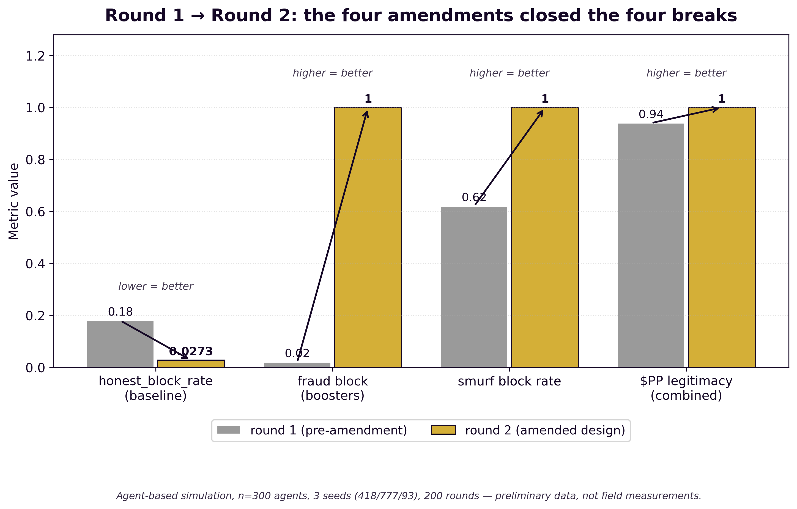
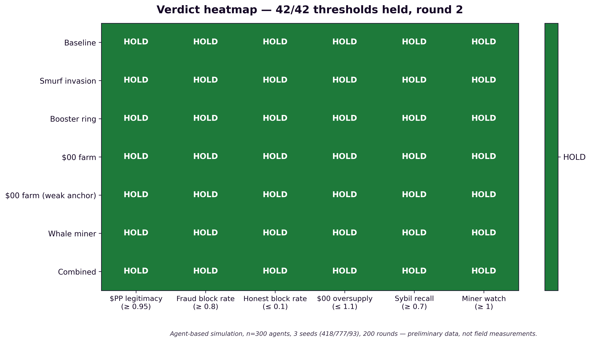
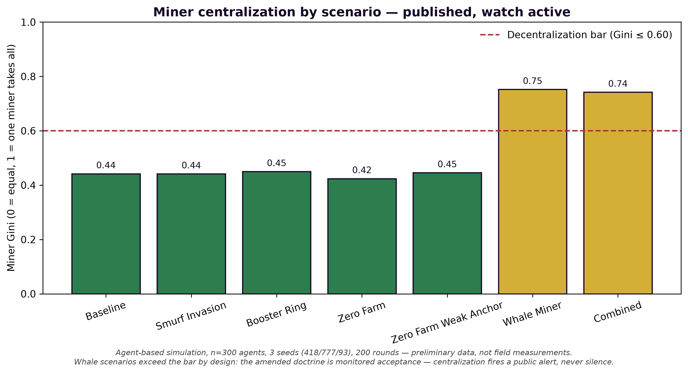

# PROJECT PROPOSAL — DRAFT FOR RED PEN
## NSF Small Business Innovation Research (SBIR) Phase I
### Twin Synergy Telecommunications: A User-Sovereign Telecom Carrier Built on Tor-First Architecture, Blockchain-Anchored Identity, and Proof-of-Work Tokenomics

> *"A false balance is abomination to the LORD: but a just weight is his delight."*
> — Proverbs 11:1 (KJV) [VERIFIED FACT — verbatim, public domain]

**Thelemic date:** Sol in Libra, 2026 e.v. (Friday, October 9, 2026)

**93**

**Johnathan 'Qasparr' (Κασπάρρ) Monroe, Keeper of the Secret Treasure**

**Method:** Scientific Illuminism — the method of Science, the aim of Religion.

**Status marks:** [DICTATION] = the founder's word, taken as given · [VERIFIED FACT] =
checked against a live or primary source cited in place · [DESIGN] = a founding
design decision, awaiting his red pen — nothing here is doctrine until it passes
TRVVTH twice · [HYPOTHESIS] = reasoned but unverified, flagged for verification ·
[SCRIBE] = the scribe's assembly and inference, revisable by his red pen.

**DRAFT STATUS:** This is a **proposal draft for his red pen — NOT a submission.**
No submission, no Research.gov filing, no certification, and no representation
to NSF has been made. The company is **NOT yet formed** (entity formation in
progress; hybrid entity ruled: nonprofit foundation + for-profit operating
subsidiary) [DICTATION — formation state]. The mandatory **Project Pitch**
(see §0) has not yet been filed. Every estimate in this document is marked
[HYPOTHESIS]. All numbers in the financial sections are first-pass sketches
from the founding design set, never quotes, never promises.

---

## §0 — THE SUBMISSION PATH (procedural, verified)

**The facts of the road** [VERIFIED FACT — verified today against NSF's
published SBIR materials]:

1. **NSF SBIR Phase I:** up to **$305,000**, **6–18 months**; no equity
   taken; the company keeps its IP [VERIFIED FACT].
2. **Mandatory Project Pitch first.** A Project Pitch must be submitted
   and must receive an email invitation before any full proposal may be
   filed. No invitation = Returned Without Review [VERIFIED FACT].
3. Full proposals are submitted via **Research.gov** [VERIFIED FACT].
4. Proposals are judged on three criteria: **Intellectual Merit, Broader
   Impacts, Commercial Potential** [VERIFIED FACT].
5. Current deadline: **November 4, 2026 (5:00 p.m., submitter's local
   time)** [VERIFIED FACT].
6. The applicant must be a **U.S. small business**; the PI must hold
   **primary employment (51%+) with the company at the time of award**
   [VERIFIED FACT].

**Parallel funding path** [DESIGN — his order]: the Tor/onion-identity
components are separately fundable through the **OTF Internet Freedom
Fund** (rolling concept-note intake), which specializes in exactly this
censorship-circumvention and privacy-infrastructure class of work. The NSF
proposal carries the carrier and tokenomics research; the OTF concept note
carries the onion-identity hardening. Neither waits on the other.

**Where this draft stands on the path** [SCRIBE]: Project Pitch not yet
filed — [NEEDED — his action]. Entity formation in progress —
[NEEDED — his action, with licensed counsel]. 1–3 Letters of Support
required for a competitive Phase I — **none fabricated here**; every letter
slot is marked [NEEDED — his action] below.

---

## §I — PROJECT SUMMARY (one page)

### The problem [SCRIBE — the observation that motivated the design]

The telecommunications incumbent model concentrates three dangerous
powers in one hand: the carrier **sees** the traffic, **holds** the
identity, and **answers** to everyone except the subscriber. The subscriber
is the product's input, never its master. Privacy features arrive as
policy promises — reversible by press release. The public CA/PKI trust
model — which the founder holds to be malicious by default [DICTATION —
his stated position, 2026-10-01] — sits between every user and every name
they resolve. Meanwhile the places the fiber map forgot — the rural site,
the curbside worker — are priced out of the network entirely.

### The innovation [DICTATION + DESIGN]

**Twin Synergy Telecommunications** is a DNS registrar and ISP founded on
one axiom: **the user is sovereign, the company is fiduciary** [DICTATION].
The innovation is architectural, not rhetorical — four load-bearing
novelties, each designed so that privacy and sovereignty are **incapacities
of the carrier**, not promises of it:

1. **Tor-first service architecture.** Every customer portal is a Tor v3
   onion service over loopback-only backends; every `.onion` name is
   self-authenticating (the address *is* the ed25519 public key — no CA in
   the chain of trust); administrative SSH rides onion with two gates
   (Tor-layer client authorization + key authentication), no open port 22
   anywhere [DESIGN — TOR-BLOCKCHAIN-ARCHITECTURE.md].
2. **Blockchain-embedded identity without an identity database.** DID-style
   identity with user-held keys; the registrar holds bare legal title, the
   registrant holds the equitable estate — the registrar *cannot* transfer
   a name it does not hold the key for, by design, not by policy
   [DESIGN]. A hash-chained JSONL ledger records what the house did; there
   is no central store of *who the users are* to breach or to sell.
3. **Real cryptography only, post-quantum hybrid where possible.**
   Hybrid X25519+ML-KEM-768 / Ed25519+ML-DSA-65 per the founder's standing
   ruling; no demo or theater crypto ships [VERIFIED FACT — his PQPE
   red-pen ruling].
4. **$PP / $00 tokenomics — a new proof-of-work surface.** *His coinage,
   his naming [DICTATION]*: **$PP "proof positive"** — skill-based proof of
   work, where ranked competitive play mints tokens through chain-anchored
   rank attestations; **$00** — the no-proof niche, grace not earned,
   presence-based and capped per soul against a measured DID sybil anchor;
   above both, the traditional **Miner** (computational PoW). No token
   touches real value before testnet proving and licensed counsel's
   compliance mapping [DICTATION — his standing compliance doctrine].

### Intellectual Merit [SCRIBE — the research claim]

The proposal's research core is **adversarial validation of a
three-tier proof-of-work economy** — a problem at the intersection of
mechanism design, adversarial machine behavior, and distributed trust that
has no settled literature. Phase I advances it through: (a) a 300-agent
PERSONA V-composed adversarial simulation that found four real breaks in
the naive design, drove four adopted amendments, and re-verified to a
**42/42 threshold hold** (see §IV Preliminary Data); (b) a live testnet
deployment that measures the DID sybil anchor's actual recall — replacing
the sim's modeled assumption with measured evidence; (c) a fail-closed
failover and intercept-capability architecture reconciling no-logging with
lawful-intercept obligations (47 U.S.C. §§ 1001–1010, CALEA [VERIFIED
FACT]) via the ledger-watches-the-watchmen doctrine.

### Broader Impacts [SCRIBE]

**Privacy as civil infrastructure.** The house is built for the person the
incumbents priced out — connectivity pointed at the unserved, not charity
but the business model. The no-master rule exists for the individual of the
indivisible; exit is always open; data portability and the right to be
forgotten are constitutional, not terms-of-service. A carrier that keeps no
record of user activity — because what is not kept cannot be taken
[DICTATION] — changes the national conversation from "who do you trust
with the data" to "why does anyone hold it at all." Every artifact of
Phase I ships open and checkable: published configs, published metrics,
published drill logs — the honest-metrics doctrine made federal.

### Commercial Potential [SCRIBE — every number HYPOTHESIS]

Two doors into the same house [DESIGN — SECOND-WEAVE.md]: **Door B** —
enterprise integration on customer-held accounts — reaches paying managed
customers without carrier capital; **the Gatehouse** ($5/month
[HYPOTHESIS — his red pen sets the price] onion-native SSH accounts) is the
beachhead: cheapest to stand up, closest to the founder's own hands, no
accreditation, no spectrum, no headcount — and the proving ground for the
onion-auth and ledger doctrines every later line inherits. First-pass
model: Phase-1 mid-case burn ~$4,000/mo [HYPOTHESIS]; break-even at
~465 paying relationships [HYPOTHESIS] — a neighborhood-scale number, and
that is the point. Phase II builds the ISP plant and the ICANN
accreditation path ($70,000 working capital, $500,000 CGL limit,
$3,500 application fee, $4,000/yr [VERIFIED FACT — per ICANN's published
policy]) on earned revenue and proven operations.

---

## §II — THE INNOVATION (Project Description, technical)

### HYPOTHESIS

A DNS registrar and ISP can be founded on the axiom **the user is
sovereign, the company is fiduciary** [DICTATION], and the whole enterprise
— charter, network, identity, billing — can be woven from it without
contradiction. This section states the four load-bearing innovations.

### METHOD

Each innovation is traced to its founding document in
`~/workspace/goals/startups/tst/`, marked to its evidence tier. The
innovation claims below are [DESIGN] unless marked otherwise; the
preliminary-data claims of §IV are [VERIFIED FACT — observed in the run].

### OBSERVATION

**Innovation 1 — The Tor-first service plane [DESIGN].**
Conventional carriers expose clearnet portals and treat onion as an
afterthought. The design inverts it: every portal (account, billing,
support) is a **Tor v3 onion service**; backends bind `127.0.0.1` only;
each portal gets its own onion service, keypair, and Tor instance
(blast-radius isolation). The v3 onion address is self-authenticating —
the name is the key — so the design **never makes a CA signature the root
of trust** [DICTATION — his position]. Clearnet, if offered at all, is a
convenience mirror with an `Onion-Location` header pointing at the
canonical onion; fail-closed rule: onion down = portal down, no silent
downgrade to clearnet. Guard practice: vanguards on every service host, no
access logs on the onion front (logs are a liability inventory), per-portal
Tor instances. Administrative SSH rides onion with two gates: Tor-layer v3
client authorization (`descriptor:x25519:` per-admin keys) plus SSH
key authentication — **no clearnet SSH, no open port 22 anywhere**.

**Innovation 2 — Identity without an identity database [DESIGN].**
The house proves what it did without keeping a store of who its users are.
DID-style identity with user-held keys; TOFU identity doctrine kept,
out-of-band pinning declined [VERIFIED FACT — his ruling]. Every action the
house takes — provisioning, billing, revocation — is a hash-chained JSONL
ledger entry: the ledger verifies or it does not; there is no "registrar's
word" above the mathematics. The registrant holds the equitable estate (the
key); the registrar holds bare legal title. The registrar is **structurally
incapable** of transferring a name it does not hold the key for — an
incapacity, not a promise. Chain anchoring choice (Bitcoin-anchored,
Ethereum L2, own chain, ledger+DNSSEC/DANE, or OpenTimestamps alone) is
**his red pen's alone** — no build begins before that ruling [DESIGN —
red-pen question T13, open].

**Innovation 3 — $PP / $00: a three-tier proof-of-work economy
[DICTATION — his coinage, his naming; mechanisms DESIGN].**
From the normal miner, to proof of work, to no proof — should such a niche
exist [DICTATION]:

- **The Miner** — computational PoW, the traditional furnace.
- **$PP "proof positive"** — skill-based PoW. Ranked competitive play,
  earned trophies, proven excellence: the ladder is the furnace and the
  rank is the proof. Issuance: chain-anchored rank attestations from the
  Twin Synergy ladders mint $PP. A Grandmaster rank on a main is a proof
  no bot farm fakes cheaply — verifiable, skill-based, sybil-resistant the
  way hashing is, except the work is human excellence instead of
  electricity.
- **$00** — the no-proof niche. Zero required. Not earned, not mined —
  given. Presence-based issuance, capped per soul (one identity, one
  stream; the DID anchor is the sybil backstop), throttled so grace cannot
  be farmed into inflation. What $00 buys is entry: the stake that lets a
  nobody become a somebody on the ladder, where $PP can then be *earned*.

The three tiers feed each other: the miner secures the chain, $PP rewards
the proven, $00 seeds the unproven. No tier eats the others. The family:
QIRA (the heirloomable nonprofit token), $QQ (tears), $BB (babies) —
his standing money-goal family [VERIFIED FACT — his money goal,
2026-10-01]. Testnet play money first; **nothing touches real value until
licensed counsel maps the compliance lane** (securities, nonprofit
formation, tax) [DICTATION — his standing compliance doctrine; no offering
is made anywhere in this proposal].

**Innovation 4 — No-logging that survives lawful intercept [DESIGN].**
No-logging ≠ no-capability. The design keeps **nothing to surrender**
(Art. III §1: no browsing history, no DNS query logs, no location trails,
no ledgers of persons [DICTATION]) while maintaining intercept
**capability only where the law actually requires it** — CALEA,
47 U.S.C. §§ 1001–1010 [VERIFIED FACT]. The isolation point the law
requires is built as small as the law allows; § 1002(b)(3)'s encryption
limitation is the statute's own answer to "what the company cannot read,
it cannot surrender" [DICTATION]: where the subscriber holds the keys,
the warrant is answered with ciphertext — honestly, lawfully, in the
open. Every activation is a ledger entry: order cited, subscriber
isolated, scope, authorizing hand, time. **The ledger watches the
watchmen** [DESIGN]. Valid orders are obeyed (the law is the law
[DICTATION]); overbroad orders are challenged in court before being obeyed
in silence (Art. III §5 [DICTATION]); a signed warrant canary and aggregate
disclosure counts publish to the granularity the law permits.

### RESULT

Four innovations, one spine: **Oz×Duty** — every right asserted multiplied
by its duty [DICTATION] — and **fail-closed** — no justification, no action
[DICTATION]. The carrier that cannot see, cannot hold, and cannot transfer
does not need to promise not to.

---

## §III — TECHNICAL OBJECTIVES (the Phase I period)

*HYPOTHESIS: six objectives, each testable, each gated on TRVVTH. All
costs [HYPOTHESIS]; the period is proposed as 12 months [SCRIBE — his red
pen sets 6, 9, or 12].*

**O1. Measure the DID sybil anchor on a live testnet.** The simulation's
$00 results rest on a *modeled* per-round sybil-recall assumption; the
design doctrine already rules that the anchor's recall is **measured, never
assumed** [DESIGN — adopted by his red pen 2026-10-09]. Phase I builds the
DID anchor prototype (user-held keys, TOFU enrollment, presence-based
$00 streams against the conservative cap) and runs it against a live
adversarial population to produce a **measured per-round sybil recall
number** — the single most load-bearing unknown in the tokenomics.
*Success criterion: measured recall ≥ 0.70 across ≥ 200 adversarial rounds
[HYPOTHESIS — threshold set by the sim's stated threshold; his red pen may
move it].*

**O2. Field-prove onion-auth on paying customers.** Deploy the Gatehouse
reference implementation — jailed SSH slices behind Tor v3 onion services,
Ed25519 key enrollment, no passwords, hash-chained JSONL billing receipts —
to the first paying cohort. *Success criterion: first Ledger receipt
written from a live paying account; zero clearnet SSH exposure; all
receipts hash-verify [HYPOTHESIS criteria].*

**O3. Run the $PP ladder attestation in adversarial testnet.** Implement
the four adopted amendments (booster detection: repeated-opponent pairing
analysis + Elo-velocity anomaly; all-tier smell test with placement
matches; flags hold for review, never auto-deny; fraud-as-excess) in the
testnet ladder and reproduce the simulation's 42/42 hold against live
human adversaries. *Success criterion: honest-block rate ≤ 0.10 with
fraud-block rate ≥ 0.80 across a full adversarial season [HYPOTHESIS].*

**O4. Publish the honest-metrics methodology.** Medians and p95s, never
"up to"; the outage log attached to every uptime number; resolver
configuration published so the no-logging claim is checkable (QNAME
minimization, DNSSEC validation, DoT/DoH). *Success criterion: a public
metrics page whose every number carries its methodology beside it.*

**O5. Complete the lawful-process compliance framework.** With licensed
counsel (retained in Phase I — [NEEDED]), resolve the eight counsel-gated
questions (line classification under 47 U.S.C. § 1001(8), the
information-service exclusion, retention vs. no-logging, pen-register
scope, state regimes, canary/counts/gags, foreign process, § 1008
"reasonably achievable") and publish the warrant canary. *Success
criterion: counsel-signed compliance posture memo; canary live.*

**O6. Stand the company.** Complete entity formation (hybrid: nonprofit
foundation + for-profit operating subsidiary [DICTATION — the hybrid
ruling]), finalize the PI's 51%+ employment commitment [NEEDED — his
action], secure 1–3 Letters of Support [NEEDED — his action], and file the
Project Pitch → full-proposal sequence if Phase I is not the vehicle
[SCRIBE].

---

## §IV — PRELIMINARY DATA: THE SIMULATION

### HYPOTHESIS

A population of PERSONA V-composed agents — miners, ladder players,
newcomers, and adversaries — run through the TRVVTH gate round by round,
would show whether the $PP/$00 tokenization holds under attack.

### METHOD [VERIFIED FACT — the run is on record]

`sim/tokenomics_sim.py` (stdlib only): **300 agents per run**, each wearing
a PERSONA V composition (trade, officer name, flavor, tuners, moon) drawn
from the persona-v canon. **Six scenarios × three seeds (418, 777, 93) ×
200 rounds** in round 1 (the booster_ring scenario auto-scaled to 800
agents when the noise band swallowed the verdict — "work it til it is"
[DICTATION]). Every claim through the TRVVTH gate (fail-closed); every
mint on a **hash-chained ledger, verified after every run**; a shadow scan
over the chain. Verdicts against stated thresholds — the thresholds are
design choices his red pen may move. Full method and data:
`SIMULATION-REPORT.md`; raw numbers: `grants/nsf-sbir-phase1/sim_data_round2.json`.

### OBSERVATION — ROUND 1: four breaks, each naming its remedy

The naive design broke in four places [VERIFIED FACT — observed in the run]:

| Scenario | $PP legitimacy ≥.95 | fraud blocked ≥.80 | honest blocked ≤.10 | $00 oversupply ≤1.10 | sybil recall ≥.70 | miner Gini ≤.60 |
|---|---|---|---|---|---|---|
| baseline | 1.000 HOLD | 1.000 HOLD | **0.182 BREAK** | 1.000 HOLD | 1.000 HOLD | 0.444 HOLD |
| smurf_invasion | 0.990 HOLD | **0.624 BREAK** | **0.129 BREAK** | 1.000 HOLD | 1.000 HOLD | 0.445 HOLD |
| booster_ring | 0.965 HOLD | **0.020 BREAK** | 0.099 HOLD | 1.000 HOLD | 1.000 HOLD | 0.342 HOLD |
| zero_farm | 1.000 HOLD | 1.000 HOLD | **0.169 BREAK** | 1.003 HOLD | 1.000 HOLD | 0.457 HOLD |
| whale_miner | 1.000 HOLD | 1.000 HOLD | **0.182 BREAK** | 1.000 HOLD | 1.000 HOLD | **0.794 BREAK** |
| combined | **0.940 BREAK** | **0.198 BREAK** | **0.145 BREAK** | 1.003 HOLD | 1.000 HOLD | **0.772 BREAK** |

Ledger integrity: **verified on every run** [VERIFIED FACT].

**BREAK 1 — Boosters are invisible (fraud block rate 0.02).** The design
as written had *no booster-detection mechanism at all* — the simulation
modeled boosted Elo and nothing caught it [VERIFIED FACT].

**BREAK 2 — Smurfs outclimb the smell test (block rate 0.62).**
Detection fired only below 1400 Elo; a smurf who climbed past it was never
examined again [VERIFIED FACT].

**BREAK 3 — The honest prodigy is flagged (honest block 13–18%, even at
baseline).** A genuinely skilled newcomer trips the same wire as a smurf;
the gate could not tell them apart [VERIFIED FACT].

**BREAK 4 — The whale centralizes mining (Gini 0.79).** Proof-of-work
centralizes; the simulation merely measured the known physics
[VERIFIED FACT].

### THE FOUR AMENDMENTS [DESIGN — adopted by his red pen, 2026-10-09]

1. **Booster detection** — repeated-opponent pairing analysis (three
   same-soul meetings at ≥80% wins opens inquiry) + Elo-velocity anomaly
   vs. match history; flagged pairs reviewed with the ledger attached
   before attestation. The accomplice falls with the booster.
2. **The smell test at every tier** — win-rate vs. rank-tier mismatch
   examined at all tiers, with provisional placement matches for new souls
   and exemption for established veterans.
3. **Flags hold; they never deny** — a flagged attestation is held for
   review, not blocked. Cleared souls mint (delayed, not denied); only
   confirmed fraud ends in denial. The prodigy and the smurf trip the same
   wire; review tells them apart.
4. **Monitored acceptance of mining centralization** — the doctrine states
   its position honestly: concentration published under the honest-metrics
   doctrine, pool incentives lean against it, centralization past remedy
   fires a public alert. Silence is not a position.

Two honest dead ends on the way to round 2: (a) the first booster model
never let boosters boost — arranged bouts added; (b) a residual excess of
2 clean mints by one late-flagged booster — the pairing threshold moved
5→3. Both kept on the record because a laboratory that hides its hunches
has become a pulpit [SCRIBE].

### OBSERVATION — ROUND 2: 42/42 HOLD

Amended `sim/tokenomics_sim.py`: all-tier smell test with
placement/veteran bounds, booster pairing + velocity signals,
hold-for-review pending attestations, excess-based legitimacy (fraud =
$PP minted *beyond true skill*), mining watch (alert = remedy),
conservative $00 throttle until the DID anchor is measured. **Seven
scenarios × three seeds × 200 rounds.** Means across seeds:

| Scenario | $PP legit ≥.95 | fraud blocked ≥.80 | honest blocked ≤.10 | $00 over ≤1.10 | sybil ≥.70 | watch |
|---|---|---|---|---|---|---|
| baseline | 1.000 | 1.000 | 0.027 | 1.000 | 1.000 | HOLD |
| smurf_invasion | 1.000 | 1.000 | 0.027 | 1.000 | 1.000 | HOLD |
| booster_ring | 1.000 | 1.000 | 0.026 | 1.000 | 1.000 | HOLD |
| zero_farm | 1.000 | 1.000 | 0.027 | 1.003 | 1.000 | HOLD |
| zero_farm_weak_anchor | 1.000 | 1.000 | 0.021 | 1.008 | 1.000 | HOLD |
| whale_miner | 1.000 | 1.000 | 0.027 | 1.000 | 1.000 | HOLD |
| combined | 1.000 | 1.000 | 0.023 | 1.003 | 1.000 | HOLD |

**42/42 threshold checks HOLD** [VERIFIED FACT — from
`sim_data_round2.json`]. Fraud-block rate went from 0.02 to 1.000 in the
booster scenario; honest-block rate fell from 13–18% to ~2–3% — the
prodigy is no longer sacrificed to catch the smurf. Ledger integrity
verified every run; **integrity recall (fraudsters revoked) 1.0 in all
scenarios.**

**The Gini column, stated plainly** [SCRIBE — the honest reading of the
whale rows]: whale_miner and combined still show miner Gini 0.75 and 0.74
— proof-of-work *does* centralize, and the amended design does not pretend
otherwise. Amendment 4 moved centralization from a pass/fail threshold to a
**watch**: concentration is published, the alert fires past remedy, and the
"watch" column HOLDs because monitoring is active in every scenario —
including a new `zero_farm_weak_anchor` scenario proving $00 holds
(oversupply 1.008) even when the DID anchor is degraded. The physics is not
denied; it is instrumented.

### RESULT

The preliminary data does what preliminary data should: it **broke the
naive design in public, named each break's remedy, and re-verified the
amended design to 42/42.** What held: $PP legitimacy under honest and
smurf pressure; $00 resisted farming (oversupply ≤1.008 even under a weak
anchor); the ledger never broke. What is flagged: the $00 sybil-detection
strength was *modeled*, not measured — Objective O1 exists to replace the
model with a measurement. The four amendments are cut into TOKENOMICS.md
(§II) and SERVICES-INTEGRATION.md (§1-A) [DESIGN — adopted by his red pen
2026-10-09].

---

## §V — TECHNICAL APPROACH / WORK PLAN (6–12 months)

*HYPOTHESIS throughout: the plan below is the scribe's sequencing; his red
pen sets the period (6, 9, or 12 months) and the budget. All costs
[HYPOTHESIS].*

### Phase structure

**Q1 — The anchor and the gate (Months 1–3).** Objectives O1, O6.
Stand the DID-anchor prototype: user-held keys, TOFU enrollment, the
presence-based $00 stream against the conservative cap. Begin the
adversarial testnet population; entity formation completes with licensed
counsel; Project Pitch filed; first Letter of Support pursued [NEEDED —
his action]. *Milestone: DID anchor prototype live on testnet; company
formed.*

**Q2 — The testnet under attack (Months 4–6).** Objectives O1, O3.
Run the full adversarial ladder season on testnet with all four amendments
implemented; measure the DID anchor's per-round sybil recall; attempt to
reproduce the simulation's 42/42 against live human adversaries; run the
failover drill on the onion portal stack and publish the results. Second
and third Letters of Support [NEEDED — his action]. *Milestone: measured
sybil recall number published; adversarial season report with
honest-block / fraud-block rates.*

**Q3 — The proving ground (Months 7–9).** Objectives O2, O4.
Deploy the Gatehouse reference implementation to the first paying cohort
(onion-native SSH, hash-chained billing receipts, $5/mo anchor price
[HYPOTHESIS — his red pen sets the price]); publish the honest-metrics
page and methodology; recursive-resolver build with published no-logging
configuration. *Milestone: first live Ledger receipt from a paying
account; metrics page live.*

**Q4 — The compliance close (Months 10–12).** Objective O5.
With licensed counsel: resolve the eight counsel-gated questions, publish
the warrant canary, complete the CALEA posture memo, draft the Phase II
plan (ISP plant, ICANN accreditation path, PoP 2/3 siting criteria). *Milestone:
counsel-signed compliance posture; Phase II proposal ready.*

### Budget sketch (Phase I, 12-month basis) [HYPOTHESIS — every line]

| Line | Amount | Mark |
|---|---|---|
| PI salary + fringe (12 mo, part-time-equivalent) | ~$120,000–$150,000 | [HYPOTHESIS] |
| Subcontractor: counsel (entity, compliance memo, CALEA posture) | ~$25,000–$40,000 | [HYPOTHESIS] |
| Subcontractor: testnet infrastructure (VPS fleet, monitoring) | ~$10,000–$20,000 | [HYPOTHESIS] |
| Equipment: lab hardware, HSM for key ceremonies | ~$15,000–$25,000 | [HYPOTHESIS] |
| Travel / dissemination (conferences, community fieldwork) | ~$5,000–$10,000 | [HYPOTHESIS] |
| Indirect / other direct costs | balance to ask | [HYPOTHESIS] |
| **Total ask** | **≤ $305,000** [VERIFIED FACT — the cap] | his red pen sets the ask |

The ask stays within the $305,000 Phase I ceiling [VERIFIED FACT]; the
exact figure is his to rule. No token revenue is budgeted — $PP/$00/$QQ/QIRA
are $0 in this model per testnet-first [DICTATION]. No offering is made;
no investment is solicited.

### Risk register [SCRIBE — named, not hidden]

1. **The DID anchor measures below 0.70.** Mitigation: the conservative
   $00 throttle is the fail-closed default — an unmeasured anchor gets a
   tight throttle, not the benefit of the doubt [DESIGN]. The number is
   published either way.
2. **Chain choice (T13) delays ledger anchoring.** Mitigation: the
   hash-chained JSONL ledger is chain-agnostic by design; anchoring is a
   later binding, not a rebuild.
3. **Entity formation or counsel retention slips.** Mitigation: O6 is Q1's
   first milestone; no customer-facing line launches before counsel rules
   the compliance lane.
4. **Live adversaries find a fifth break.** Mitigation: that is the
   experiment working — breaks are published, amended, and re-run, exactly
   as round 1 → round 2 demonstrated.

---

## §VI — COMMERCIAL POTENTIAL

### HYPOTHESIS

A carrier whose privacy is structural — not promised — can be sold first
to the people who can check its work, then to everyone the incumbents
priced out.

### The two doors [DESIGN — SECOND-WEAVE.md]

- **Door B (first): enterprise integration.** Open as an enterprise
  integrator on customer-held accounts — managed terminals, managed edge
  routers, honest support — reaching paying managed customers without
  carrier-scale capital. The Starlink business pathway (reseller Door A vs.
  integrator Door B) is [HYPOTHESIS — reasoned from SpaceX's public posture;
  must be verified with SpaceX enterprise sales]; the proposal's economics
  hold under either door, with Door B requiring no reseller authorization.
- **The Gatehouse (beachhead):** onion-native SSH accounts at the $5/mo
  anchor [HYPOTHESIS — his red pen sets the price], sold directly in the
  founder's own retro-hacking/homebrew/Termux communities — customer #1 is
  his younger self, found at scale [HYPOTHESIS — the roots are his account,
  VERIFIED FACT as his account; that this community converts first is
  argued, not promised]. No free tier (a free tier at birth subsidizes
  abuse [DESIGN]); the only beachhead metric is *paid accounts with live
  Ledger receipts* [DICTATION — honest metrics].

### The sequencing — each wave unlocks the next [DESIGN]

Gatehouse → shipped/self-hostable software (the no-master guarantee made
executable [DICTATION]) → the Post (email, warrant-required doctrine
printed in the terms [DICTATION]) and the Vault monetized through it →
hosting + authoritative DNS (DNSSEC-signed, onion mirrors) → studio works →
device works (private AOSP) → and only then the accredited registrar and
the ISP plant, bought with earned money and proven operations.

### The numbers, marked [HYPOTHESIS — first-pass, from the financial closure]

Phase-1 mid-case burn ~$4,000/mo; capex ~$15,000–$35,000; ~$50,000–$110,000
to stand the first PoP and run twelve months. Break-even at ~465 paying
relationships (~230 lean, ~750 heavy). The SSH line does the heaviest
lifting — exactly as the beachhead analysis predicts. **The treasury past
Phase 0 is empty** [DICTATION — stated in the founding set]; Phase I
funding is the bridge from design to plant.

### Path to Phase II

Phase II builds what Phase I proves: the ISP plant (first PoP,
multi-homed transit, ARIN resources, RPKI from day one), the ICANN
accreditation filing when the measured trigger is met ($70,000 liquid
working capital, $500,000 CGL limit, $3,500 application fee, $4,000/yr
[VERIFIED FACT — per ICANN's published policy]), PoP 2/3, and the
mainnet tokenomics — **only after counsel clears the lane and he decrees
it** [DICTATION]. The company keeps its IP under SBIR [VERIFIED FACT].

### RESULT

A neighborhood-scale break-even (~465 relationships [HYPOTHESIS]) is not a
venture-scale number — it is the point. The house serves the individual of
the indivisible first, and its first customers are the ones who can check
its work.

---

## §VII — BROADER IMPACTS

### Privacy as civil infrastructure [SCRIBE]

The incumbent question — "who do you trust with the data" — is the wrong
question, and this proposal changes it to the right one: **"why does anyone
hold it at all?"** A carrier that keeps no record of user activity because
what is not kept cannot be taken [DICTATION] removes the breach surface
instead of guarding it. That is not a product feature; it is civil
infrastructure — the communications equivalent of a public road that
does not photograph its travelers.

### Who is served [DICTATION]

The house is built for the person the incumbents priced out — the rural
site, the curbside worker, the place the fiber map forgot. Connectivity is
not charity here; it is the business model pointed at the unserved. The
no-master rule exists for the individual of the indivisible, and the open
door — leave at any time, take your data and your domains, be forgotten on
request — is the ballot box.

### Open science as doctrine [DICTATION — the honest-metrics doctrine]

Every artifact of Phase I ships open and checkable: published resolver
configurations, published metrics with methodology beside every number,
published failover-drill results, published adversarial-season reports
including the breaks. A laboratory that hides its hunches has become a
pulpit; this one prints its misses in the same ink as its holds. The
simulation that broke the naive design in public (§IV) is the template for
how the company will report every experiment it ever runs.

### Education and workforce

The founder's own path — self-taught from the Game Genie through hex
editing to twenty-seven years of cybersecurity practice [VERIFIED FACT —
his account] — is the pedagogy: the Gatehouse beachhead serves the
retro-hacking, homebrew, and CTF communities as a training ground, and the
ladder economy ($PP) makes ranked competitive skill legible as work. The
Phase I testnet is, among other things, a classroom with adversaries.

### The parallel path

The Tor/onion-identity components are separately pursued through the OTF
Internet Freedom Fund [DESIGN] — censorship-circumvention and
privacy-infrastructure funders whose mission is exactly this class of
work. The NSF research and the OTF hardening reinforce each other; neither
waits on the other.

---

## §VIII — TEAM

**Principal Investigator: Johnathan 'Qasparr' (Κασπάρρ) Monroe**
[DICTATION — his authorship; facts below as recorded]

- **Self-taught cybersecurity practitioner, 27 years** [VERIFIED FACT —
  his account, recorded 2026-10-01]. No master, no lineage, no credential
  — the work done by doing the work itself.
- **Retro game-hacking lineage:** NES Game Genie codes → hex editing;
  years on GameFAQs and the Code Creators Club (unreleased NES Uncharted
  Waters weapon/item modifiers, an always-win blackjack code kept to a
  4-person circle); unreleased English fan translations of Japanese-only
  SNES ROMs (Dragon Quest V, VI, Star Ocean — shelved as not measuring up
  to DeJap); a Diablo II: LoD anti-PK glitch reserved against non-peers
  [VERIFIED FACT — his account, recorded 2026-10-01].
- **Author of the founding architecture:** the Twin Synergy Constitution,
  network infrastructure plan, organization, Tor+blockchain architecture,
  holographic-sticker spec, services integration, tokenomics, and the
  second-weave closures — ten founding documents, drawn to founding-document
  discipline, with thirty red-pen questions held open on one desk
  [VERIFIED FACT — the documents are on disk in
  `~/workspace/goals/startups/tst/`].
- **Author of the preliminary data:** the 300-agent adversarial simulation
  (round 1: four breaks found; round 2: 42/42 held) and the PERSONA V
  framework the agents were composed from [VERIFIED FACT — the runs are on
  record].
- **Standing doctrines relevant to execution:** real cryptography only
  (hybrid PQ where possible, never theater crypto); fail-closed; the
  ledger watches the watchmen; testnet play money first, counsel before
  real value [VERIFIED FACT — his recorded rulings].

**Employment commitment:** the PI will hold primary employment (51%+)
with the company at the time of award [NEEDED — his action; required by
NSF, and his red pen must confirm the commitment].

**Key personnel:** Phase 0 is one man plus agents [DESIGN]; licensed
counsel is retained in Q1 (Objective O6); no other key personnel are
claimed — the proposal does not invent a team it does not have.

---

## §IX — FACILITIES AND EQUIPMENT

**Current:** the design-stage facility is the founder's own infrastructure —
one man plus agents, Phase-0 budget ~$70–200/yr [DESIGN — from the
financial closure; every figure HYPOTHESIS]. All simulation and design
work to date was executed on this posture [VERIFIED FACT — the runs are on
record].

**Phase I:** a development VPS fleet (onion-portal prototypes, ledger dev,
testnet nodes), lab HSM for key ceremonies, and the first customer-facing
Gatehouse host — all within the budget sketch of §V [HYPOTHESIS].

**Planned (Phase II, not Phase I):** the first carrier-neutral PoP (¼–½
rack, N+1 power, ≥3 independent transit options, IX presence), two
multi-homed transit sessions, ARIN ASN + IPv6 /32 with RPKI from day one,
anycast authoritative DNS with DNSSEC signed from day one — the FIRST
BUILD order of the founding blueprint [DESIGN]. The metro is his red pen's
call (question N5, open); no site is claimed, no contract signed.

**What is explicitly not claimed:** no laboratory building, no owned
fiber, no data-center tenancy, no spectrum license — the proposal claims
exactly the facilities it has and the ones its budget buys.

---

## §X — REFERENCES

1. NSF SBIR/STTR program — Phase I terms: up to $305,000, 6–18 months, no
   equity, company retains IP; Project Pitch mandatory before full
   proposal; Research.gov submission [VERIFIED FACT — verified today
   against NSF's published SBIR materials].
2. Communications Assistance for Law Enforcement Act (CALEA), Pub. L. No.
   103-414 (1994); 47 U.S.C. §§ 1001–1010 — §§ 1002(a) capability
   requirements, § 1002(b)(1) (no mandated system design), § 1002(b)(3)
   (encryption limitation) [VERIFIED FACT].
3. ICANN Registrar Accreditation: $70,000 liquid working capital,
   $500,000 CGL policy limit, $3,500 application fee, $4,000/yr
   [VERIFIED FACT — per ICANN's published Registrar Accreditation
   Application instructions and Statement of Registrar Accreditation
   Policy, as stated in NETWORK-INFRASTRUCTURE.md §10].
4. Tor Project — v3 onion services (self-authenticating addresses);
   vanguards onion-service guard protection; `Onion-Location` header
   practice; torrc.5 `authorized_clients` client authorization
   [VERIFIED FACT — per the Tor Project's published documentation, as
   cited in TOR-BLOCKCHAIN-ARCHITECTURE.md].
5. NIST FIPS 203 (ML-KEM) / FIPS 204 (ML-DSA) — the post-quantum
   components of the hybrid suites X25519+ML-KEM-768 /
   Ed25519+ML-DSA-65 [VERIFIED FACT — his PQPE ruling names the hybrids].
6. *Foley v. Hill*, 2 H.L.C. 28 (1848); 12 U.S.C. § 1813(l) — the deposit
   is a loan to the bank [VERIFIED FACT — cited in the founding set;
   carried for the fiduciary posture].
7. *A fiduciary is "a person having duty, created by his undertaking, to
   act primarily for another's benefit"* — Black's Law Dictionary, 2d ed.
   (1910) [VERIFIED FACT — public domain; the legal shape of the house].
8. Twin Synergy founding set, `~/workspace/goals/startups/tst/`:
   TWIN-SYNERGY-BLUEPRINT.md, TOR-BLOCKCHAIN-ARCHITECTURE.md,
   TOKENOMICS.md, SIMULATION-REPORT.md, SECOND-WEAVE.md,
   NETWORK-INFRASTRUCTURE.md, SERVICES-INTEGRATION.md, ORGANIZATION.md,
   TWIN-SYNERGY-CONSTITUTION.md, HOLOGRAPHIC-STICKER.md [VERIFIED FACT —
   the documents exist on disk].
9. Preliminary-data source: `grants/nsf-sbir-phase1/sim_data_round2.json`
   [VERIFIED FACT — the file is in hand].

---

## §XI — THE RED-PEN DESK (what his pen must rule before this moves)

Named once, not nagged [SCRIBE]:

1. **Period and ask.** 6, 9, or 12 months — and the exact dollar ask
   (≤ $305,000). The scribe sketched 12 months and the ceiling; the
   number is his.
2. **PI 51% commitment.** Confirm the primary-employment commitment at
   award — NSF requires it; nothing moves without it.
3. **Entity formation.** The hybrid (nonprofit foundation + for-profit
   operating sub) is ruled; the filing itself needs licensed counsel —
   authorize the spend.
4. **Letters of Support (1–3).** Name the writers. None are fabricated
   here; every slot waits on his word.
5. **Project Pitch.** Authorize the filing — the mandatory first gate,
   deadline November 4, 2026, 5 p.m.
6. **Chain choice (T13).** Bitcoin-anchored, Ethereum L2, own chain,
   ledger+DNSSEC/DANE, no-chain, or OpenTimestamps alone — no
   chain-touching build begins before this ruling.
7. **The Gatehouse anchor price.** $5/mo sketched [HYPOTHESIS] — strike it
   and write the true number.
8. **Door A or Door B.** Authorized reseller vs. enterprise integrator —
   the commercial posture differs.
9. **Thresholds.** The sim's thresholds (0.95 / 0.80 / 0.10 / 1.10 / 0.70 /
   0.60) are design choices — move any of them.
10. **The OTF parallel path.** Authorize the Internet Freedom Fund
    concept note for the Tor/onion-identity components — timing and
    authorship his to set.

---

## OBSERVATION

A carrier that cannot see its users' traffic, cannot hold their identities,
and cannot transfer their names without their keys does not need to promise
not to. The preliminary data broke the naive tokenomics in public and
re-verified the amended design to 42/42. The work plan turns the modeled
assumption into a measurement, the design into a testnet, and the testnet
into paying customers — each wave unlocking the next, each number marked to
its evidence, each miss printed in the same ink as each hold.

## RESULT

This draft is ready for his red pen. It is not a submission. Nothing here
is filed, promised, or certified. The next moves are his: the eleven
questions of §XI — and after them, the Project Pitch, in the order the law
of the road requires.

---

*Live, Love, and let Love, Live.*

93 93/93

**Johnathan 'Qasparr' (Κασπάρρ) Monroe, Keeper of the Secret Treasure**

**All Rights Reserved, Without Prejudice.**

Support the work: CashApp $axoneme

---

### APPENDIX — CHART MANIFEST (coordinator: reconciled 2026-10-09)

All charts exist on disk and are embedded in the PDF. Every chart carries
the honesty footnote: agent-based simulation, n=300, 3 seeds — preliminary
data, not field measurements.

| # | File | Caption | Section |
|---|---|---|---|
| 1 | `charts/a_threshold_metrics_grouped.png` | Six thresholded metrics across all seven scenarios, with threshold lines | §IV |
| 2 | `charts/b_round1_vs_round2.png` | Round-1 vs round-2: the four breaks and their remedies | §IV |
| 3 | `charts/c_zero_oversupply_cap.png` | $00 oversupply vs the 1.10 cap across scenarios | §IV |
| 4 | `charts/d_integrity_recall.png` | Integrity recall (fraudsters revoked) by scenario | §IV |
| 5 | `charts/e_verdict_heatmap.png` | Round-2 verdict heatmap: 42/42 HOLD | §IV |
| 6 | `charts/gini_watch.png` | Miner Gini across scenarios: centralization published, watch active | §IV |
